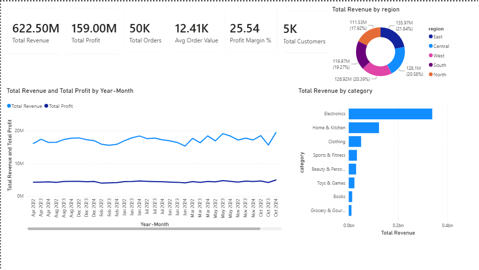

# 📊 E-Commerce Sales & Customer Insights

> **SQL · Python · Pandas · Power BI** — End-to-end data analytics portfolio project

---

## 🎯 Project Overview

This project simulates a real-world data analyst role at an e-commerce company. It covers the **complete analytics pipeline** — from raw data generation and cleaning, through SQL analysis, to an interactive Power BI dashboard — and produces actionable business insights and recommendations.

**Dataset:** 100,000 orders | 5,000 customers | 65 products | 8 categories | 3 years (2022–2024)

---

## ❓ Business Problem

As a data analyst for an online shopping company, the business wants answers to:

- Which products generate the most revenue?
- Which categories are most profitable?
- Which months have the highest/lowest sales?
- Which regions perform best?
- Who are the most valuable customers?
- Are repeat customers spending more?
- What is the average order value?
- Which customer segments should be targeted?
- Where are sales declining?

---

## 🛠️ Tools & Technologies

| Layer | Tool | Purpose |
|---|---|---|
| Data Generation | Python, Faker, NumPy | Synthetic 100K dataset |
| Data Cleaning | Python, Pandas | Cleaning, feature engineering |
| EDA | Matplotlib, Seaborn | 13 analytical charts |
| RFM Segmentation | Python, Pandas | Customer segmentation |
| Database | MySQL 8.0 | Storage + SQL analysis |
| SQL | MySQL Workbench | 12 analysis queries |
| Visualization | Power BI Desktop | Interactive dashboard |
| Version Control | Git, GitHub | Portfolio hosting |

---

## 📁 Project Structure

```
ecommerce-analytics/
│
├── data/
│   ├── raw/                    ← Generated raw CSVs
│   │   ├── customers.csv
│   │   ├── products.csv
│   │   ├── orders.csv
│   │   └── order_items.csv
│   └── cleaned/                ← Cleaned + engineered CSVs
│       ├── customers_clean.csv
│       ├── products_clean.csv
│       ├── orders_clean.csv
│       ├── order_items_clean.csv
│       ├── flat_sales.csv
│       ├── customer_stats.csv
│       ├── rfm_segments.csv
│       └── rfm_segment_stats.csv
│
├── python/
│   ├── 01_generate_dataset.py  ← Phase 1: Dataset generation
│   ├── 02_data_cleaning.py     ← Phase 2: Cleaning + feature engineering
│   ├── 03_eda.py               ← Phase 3: EDA charts
│   └── 04_rfm_segmentation.py  ← Phase 4: RFM customer segmentation
│
├── mysql/
│   ├── 01_schema.sql           ← Database schema (5 tables)
│   ├── 02_load_data.py         ← Python MySQL data loader
│   └── 03_analysis_queries.sql ← 12 SQL analysis queries
│
├── visualizations/             ← 13 EDA + RFM charts (PNG)
│
├── insights/
│   └── business_insights.md   ← 8 findings + recommendations
│
├── powerbi/
│   └── ecommerce_dashboard.pbix
│
└── README.md
```

---

## 🔄 Pipeline Architecture

```
Raw Dataset (Python/Faker)
        ↓
  Data Cleaning (Pandas)
  • Remove duplicates
  • Fix data types
  • Handle null values
  • Feature engineering
        ↓
  MySQL Database
  • 4 normalized tables
  • Relational schema
        ↓
  SQL Analysis (12 queries)
  • GROUP BY, JOINs
  • CTEs, Subqueries
  • Window Functions (RANK, LAG, SUM OVER)
        ↓
  Power BI Dashboard
  • KPI Cards
  • Trend Charts
  • Regional Maps
  • Customer Segments
        ↓
  Business Insights & Recommendations
```

---

## 🧹 Data Cleaning

**File:** `python/02_data_cleaning.py`

| Issue | Action Taken |
|---|---|
| 200 duplicate order rows | `drop_duplicates()` |
| 50 missing customer emails | Filled with placeholder pattern |
| Missing phone numbers | Filled with "N/A" |
| 50 invalid order dates ("9999-99-99") | `pd.to_datetime(errors='coerce')` → drop NaT rows |
| Negative quantity values | Filtered out rows where quantity ≤ 0 |
| Float quantities with NaN | Dropped NaN rows, cast to int |
| Cancelled/Returned orders in revenue | Filtered to `status = 'Delivered'` only |

**Feature Engineering:**
```python
flat["revenue"]          = flat["quantity"] * flat["unit_price"]
flat["profit"]           = flat["revenue"] - flat["cost"]
flat["profit_margin"]    = flat["profit"] / flat["revenue"]
flat["order_year"]       = flat["order_date"].dt.year
flat["order_month"]      = flat["order_date"].dt.month
flat["order_quarter"]    = flat["order_date"].dt.quarter
```

---

## 🗄️ SQL Analysis

**File:** `mysql/03_analysis_queries.sql`

### Key Query Examples

**1. Top 10 Products by Revenue** (GROUP BY + ORDER BY)
```sql
SELECT product_name, category,
    SUM(quantity)                        AS total_units_sold,
    ROUND(SUM(revenue), 0)               AS total_revenue,
    ROUND(SUM(profit)/SUM(revenue)*100,1) AS profit_margin_pct
FROM flat_sales
GROUP BY product_name, category
ORDER BY total_revenue DESC
LIMIT 10;
```

**2. Month-over-Month Growth** (CTE + LAG Window Function)
```sql
WITH monthly AS (
    SELECT YEAR(order_date) AS yr, MONTH(order_date) AS mo,
           ROUND(SUM(revenue),0) AS revenue
    FROM flat_sales
    GROUP BY yr, mo
)
SELECT period, revenue,
    LAG(revenue,1) OVER (ORDER BY yr, mo)     AS prev_month,
    ROUND((revenue - LAG(revenue,1) OVER (ORDER BY yr, mo))
          / LAG(revenue,1) OVER (ORDER BY yr, mo) * 100, 1) AS mom_growth_pct
FROM monthly;
```

**3. Customer Ranking** (RANK() Window Function)
```sql
SELECT customer_id, customer_name,
    ROUND(SUM(revenue),0) AS total_revenue,
    RANK() OVER (ORDER BY SUM(revenue) DESC) AS revenue_rank
FROM flat_sales
GROUP BY customer_id, customer_name
ORDER BY revenue_rank
LIMIT 25;
```

**Full query list:**

| # | Query | SQL Concepts Used |
|---|---|---|
| 1 | Top 10 Products by Revenue | GROUP BY, ORDER BY, LIMIT |
| 2 | Monthly Revenue & Profit Trend | DATE functions, GROUP BY |
| 3 | Revenue & Profit by Category | CASE WHEN, GROUP BY |
| 4 | Regional Sales Performance | JOIN, GROUP BY, multiple aggregates |
| 5 | Top 20 Customer Lifetime Value | Subquery, DATEDIFF |
| 6 | Customer Ranking | RANK(), DENSE_RANK(), ROW_NUMBER() |
| 7 | Running Total Revenue | SUM() OVER (ORDER BY) |
| 8 | Month-over-Month Growth | CTE + LAG() |
| 9 | Repeat vs New Customers | Multiple CTEs + CASE WHEN + JOIN |
| 10 | Quarterly Revenue by Region | CASE WHEN Pivot |
| 11 | Declining Regions (YoY) | Multiple CTEs + LAG() + PARTITION BY |
| 12 | RFM Segment Revenue | JOIN to rfm_segments table |

---

## 📈 EDA Visualizations

13 professional dark-themed charts generated by Matplotlib + Seaborn:

| # | Chart |
|---|---|
| 1 | Monthly Revenue & Profit Trend (2022–2024) |
| 2 | Revenue by Product Category |
| 3 | Profit Margin % by Category |
| 4 | Top 10 Products by Revenue |
| 5 | Revenue Distribution by Region (Donut) |
| 6 | Year-over-Year Monthly Revenue Comparison |
| 7 | Customer Lifetime Spending Distribution |
| 8 | Repeat vs New Customers (3-panel) |
| 9 | Order Status Distribution (Donut) |
| 10 | Monthly Revenue Heatmap (Month × Year) |
| 11 | RFM Customer Segment Distribution |
| 12 | Revenue Share by Customer Segment (Donut) |
| 13 | Customer Segments: Frequency vs Monetary Scatter |

---

## 🧠 RFM Customer Segmentation

**File:** `python/04_rfm_segmentation.py`

RFM scores each customer on 3 dimensions (1–5 scale):

| Dimension | Meaning | Scoring |
|---|---|---|
| **R**ecency | Days since last purchase | 5 = bought recently |
| **F**requency | Number of orders | 5 = orders very often |
| **M**onetary | Total lifetime spend | 5 = highest spender |

### Segment Results

| Segment | Customers | Revenue Share | Avg Spend |
|---|---|---|---|
| Champions | 1,068 (21.5%) | 58.1% | ₹3,38,673 |
| Loyal Customers | 1,031 (20.7%) | 20.0% | ₹1,20,854 |
| At Risk | 434 (8.7%) | 8.2% | ₹1,16,983 |
| Lost | 986 (19.8%) | 4.4% | ₹27,792 |
| Cannot Lose Them | 230 (4.6%) | 4.1% | ₹1,09,733 |
| Hibernating | 554 (11.1%) | 2.5% | ₹27,883 |
| Potential Loyalists | 495 (10.0%) | 2.4% | ₹29,558 |
| Promising | 175 (3.5%) | 0.4% | ₹15,440 |

---

## 💡 Key Business Insights

1. **21.5% of customers (Champions) generate 58.1% of revenue** → VIP retention is the #1 priority
2. **Electronics = highest revenue but lowest margin** → Cross-sell high-margin Beauty products
3. **Q4 (Oct–Dec) drives 35–45% more sales** → Plan inventory & campaigns by August
4. **986 Lost customers** need win-back campaigns before full churn
5. **434 At Risk customers** are high-value and recoverable — immediate action needed
6. **Repeat customers** have significantly higher average order value than first-time buyers

---

## 📊 Power BI Dashboard

**File:** `powerbi/ecommerce_dashboard.pbix`



Interactive dashboard connected directly to MySQL:

1. **Executive Summary** — Revenue, Profit, Orders, Customers, AOV, Margin KPIs
2. **Sales Trends** — Monthly line chart, MoM growth bar chart, YoY comparison
3. **Product & Category** — Category bars, Top 10 products table, margin visual
4. **Regional Performance** — Map visual, region bar chart, quarterly breakdown
5. **Customer Analytics** — RFM segment donut, CLV distribution, repeat vs new

---

## 📋 Business Recommendations

| Priority | Action |
|---|---|
| 🔴 Urgent | Launch VIP Loyalty Program for 1,068 Champion customers |
| 🔴 Urgent | At Risk recovery campaign — 10% discount + personalized email |
| 🔴 Urgent | First-repeat-purchase trigger campaign (Day 7 + Day 14) |
| 🔴 Urgent | Q4 campaign planning starting August — 40% budget allocation |
| 🟡 Medium | Win-back campaign for 986 Lost customers |
| 🟡 Medium | Cross-sell Beauty to Electronics buyers |
| 🟡 Medium | Logistics audit in Central & West regions |
| 🟢 Long-term | Book + Grocery subscription bundle testing |

---

## 🚀 How to Run

### Prerequisites
- Python 3.8+
- MySQL Server 8.0
- Power BI Desktop (free)

### Installation
```bash
pip install pandas numpy matplotlib seaborn faker mysql-connector-python
```

### Step-by-Step

```bash
# 1. Generate dataset
python python/01_generate_dataset.py

# 2. Clean data
python python/02_data_cleaning.py

# 3. EDA charts
python python/03_eda.py

# 4. RFM segmentation
python python/04_rfm_segmentation.py

# 5. MySQL setup
# Run mysql/01_schema.sql in MySQL Workbench

# 6. Load data into MySQL (update password first)
python mysql/02_load_data.py

# 7. Run SQL queries
# Open mysql/03_analysis_queries.sql in MySQL Workbench

# 8. Open Power BI
# Open powerbi/ecommerce_dashboard.pbix
# Connect to MySQL localhost > ecommerce_analytics
```

---

## 📝 Resume Bullet Points

```
E-Commerce Sales & Customer Analytics | SQL · Python · Pandas · Power BI

• Designed a normalized MySQL schema and generated a synthetic 100K+ row 
  e-commerce dataset using Python (Faker, NumPy) simulating real-world 
  customer, order, and product data across 3 years.

• Cleaned and engineered features from raw data using Pandas — handling 
  nulls, duplicates, invalid dates, and creating revenue, profit, margin, 
  and time-dimension columns.

• Developed 12 MySQL queries using CTEs, JOINs, CASE WHEN, subqueries, 
  and window functions (RANK, LAG, SUM OVER) to analyze revenue trends, 
  customer value, category profitability, and regional performance.

• Built RFM (Recency-Frequency-Monetary) customer segmentation in Python, 
  classifying 4,973 customers into 8 actionable segments; identified that 
  21.5% of customers (Champions) generate 58.1% of total revenue.

• Created an interactive 5-page Power BI dashboard with KPI cards, trend 
  charts, regional maps, and customer segment visuals, producing 8 
  data-backed business recommendations.
```

---

## 👤 Author
**Swayam Prakash Pradhan**
Data Analyst | SQL | Python | Power BI
📧 **Email:** swayamprakashpradhan456@gmail.com 
🔗 **LinkedIn:** [LinkedIn Profile](https://www.linkedin.com/in/swayam-pradhan2002/)

